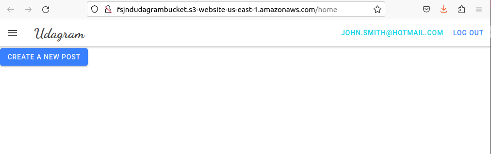

### FSJND - Hosting a Full Stack Application

#### Project overview

This project contains workflow to deploy a fullstack app, **Udagram** in AWS with a CI/CD pipeline, <a href="https://circleci.com/">CircleCI</a>.

We will make use of the AWS console to start and configure the services that the application needs such as 

- a database to store product information, and 

- a web server allowing the site to be discovered by potential customers.

The frontend of the deployed app, **Udagram** can be accessed at: http://fsjndudagrambucket.s3-website-us-east-1.amazonaws.com/

#### Screenshot of the deployed frontend

#### Detailed documentations

- <a href="docs/AppDependencies.md">Dependencies</a>

- <a href="docs/InfrastructureDescription.md">Infrastructure description</a>

- <a href="docs/PipelineProcess.md">Pipeline process</a>
