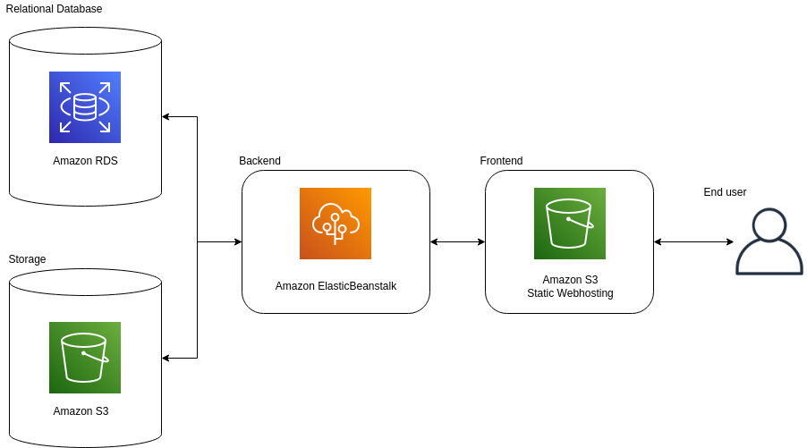
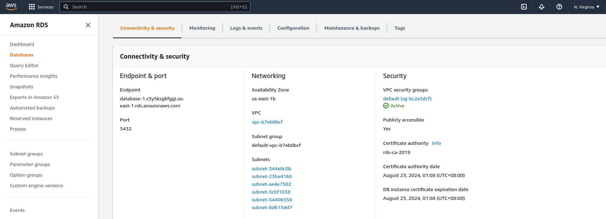
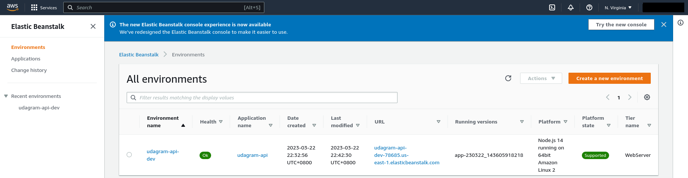
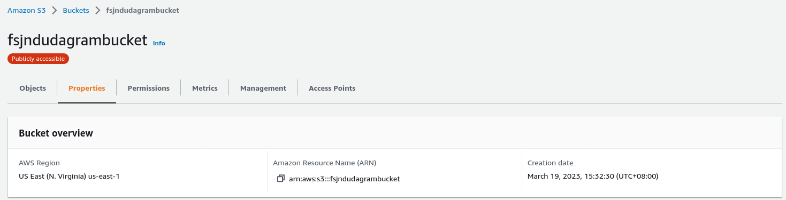

### FSJND - Hosting a Full Stack Application

#### Infrastructure description

A high level overview of the infrastructure of the deployed application, **Udagram** is as shown below:

Architecture diagram of <b>Udagram</b>

1. The application **frontend**, `udagram-frontend` is hosted with **Amazon S3 static website hosting**.

1. The application **backend**, `udagram-api` is hosted with **Amazon Elastic Beanstalk**.

1. **Data** within the application backend are stored with 

    - **Amazon RDS relational database**, and
    - **Amazon S3 bucket**

#### Infrastructure setup screenshots

1. AWS RDS for the database

    

1. AWS ElasticBeanstalk (or alternatives like lambda) for the API

    

1. AWS s3 for web hosting

    

<a href="../README.md">Back</a>