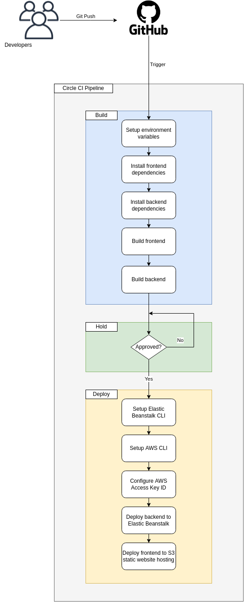
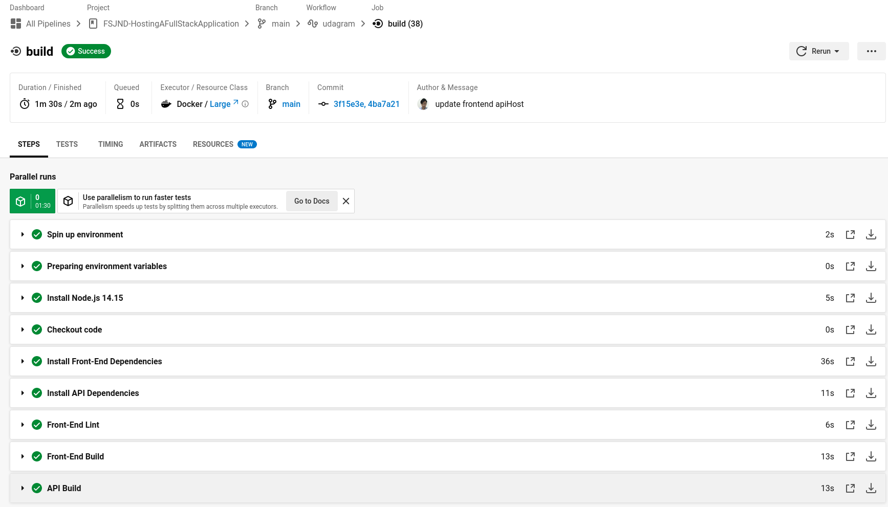
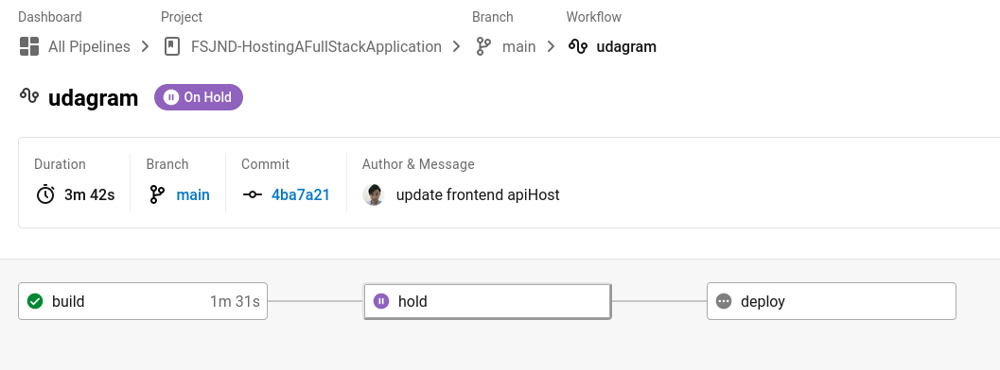
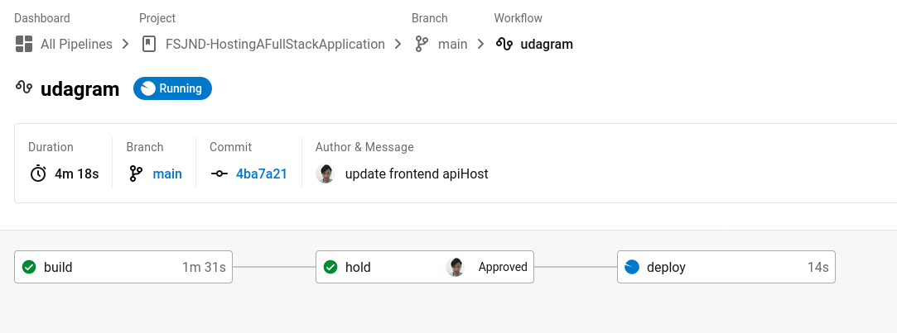
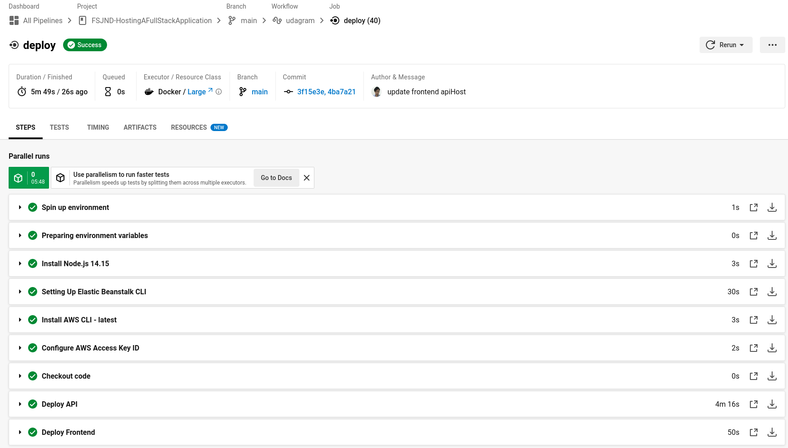
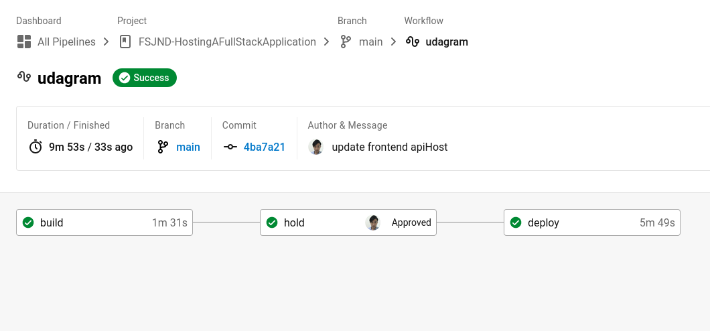

### FSJND - Hosting a Full Stack Application

#### Pipeline process

A high level overview of the pipeline process is illustrated in the diagram below:

Pipeline process overview

In summary,

1. Developers will commit the source code (containing both front and backend applications) into Github repo, which will then trigger the execution of a CircleCI pipeline.

1. Three stages of CircleCI pipeline will be executed in the following order:

    1. **Build** - This will setup environment, install dependencies and build both front and backend applications, to ensure the committed source can be built correctly.
    1. **Hold** - User approval in CircleCI is then required in order to proceed into the deployment stage.
    1. **Deploy** - This will trigger the setup of Elastic Beanstalk and AWS CLI, configuration of AWS IAM access keys, and finally deployment of the frontend and backend app into S3 static website hosting bucket and Elastic Beanstalk respectively.

#### Pipeline setup screenshots

1. Build stage of CircleCI pipeline.

    

1. Hold stage of CircleCI pipeline.

    

1. Hold stage of CircleCI pipeline being approved.

    

1. Deploy stage of CircleCI pipeline.

    

1. Entire CircleCI pipeline completed.

    

<a href="../README.md">Back</a>